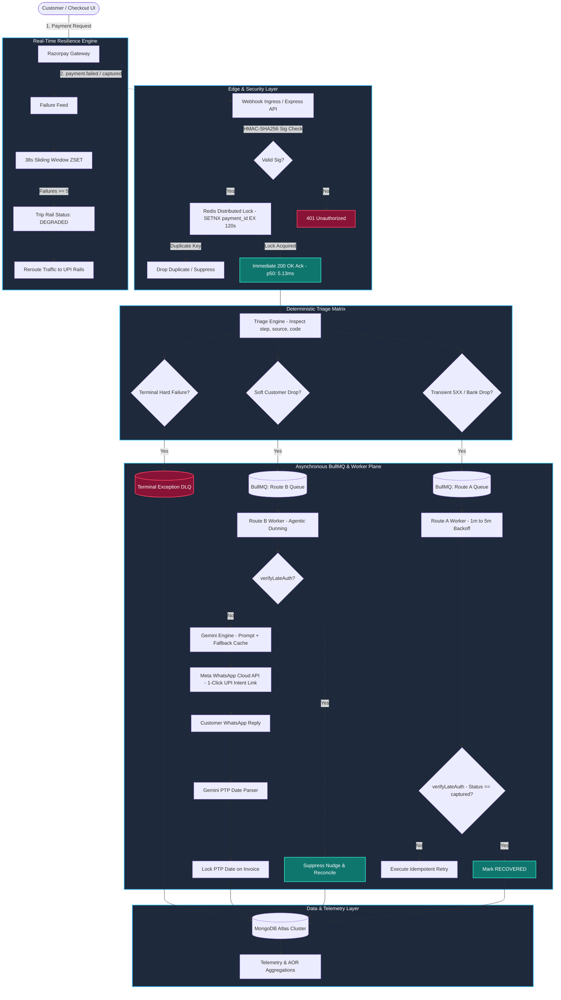

<div align="center">

# 🛡️ RevRecover
### Autonomous AI Revenue Recovery Engine

**Find revenue that's slipping away — and win it back, automatically.**

[](#)
[](#)
[](#)

*Built for the Razorpay AI Buildathon — Build. Show. Get hired.*

</div>

---

## 🎯 The Problem

In Indian digital commerce and B2B SaaS, **20–35% of checkout failures are addressable revenue leaks** — money that was never actually lost, just never chased. RevRecover exists because revenue loss rarely happens in one clean step:

| # | Problem | Real-World Cost |
|---|---|---|
| 1 | **Flapping Banking Rails** | Transient 5XX errors and bank maintenance windows cause silent checkout abandonment |
| 2 | **"Money Debited but Order Failed"** | Out-of-order webhooks trigger support tickets and chargebacks for money the customer already paid |
| 3 | **Blind Dunning Spam** | Systems retry expired cards or spam customers when the *bank* — not the customer — actually failed |
| 4 | **B2B Invoicing Churn** | Overdue invoices sit in manual email chains with no committed settlement date and no escalation path |

RevRecover closes the loop: **detect → diagnose → intervene → recover**, with a full audit trail at every step.

---

## 🏗️ System Architecture



---

## ⚡ Core Features

| Layer | What It Does |
|---|---|
| **🔐 Ingress** | HMAC-SHA256 signature verification + Redis-locked idempotency drops duplicate webhooks in <2ms; responds `200 OK` in ≤5ms, offloading persistence to background queues |
| **🧭 Triage** | Deterministic routing — **Route A** (gateway/technical), **Route B** (customer-side drops), **Route C** (expired cards, fraud, compliance) |
| **🔁 Route A — Silent Self-Heal** | 1m→2m→5m BullMQ retry ladder with a late-authorization check before every retry, so the system self-heals instead of blindly re-charging |
| **💬 Route B — Agentic Dunning** | Late-auth check → Gemini-generated recovery message (Hindi/English) → 1-click WhatsApp UPI payment link; Gemini also extracts B2B promise-to-pay commitments from replies |
| **🛑 Route C — Compliant Stop** | Retries halted immediately to avoid card-network penalty fees; security/compliance codes logged, zero retry spam |
| **⚙️ Resilience Engine** | Redis sliding-window circuit breaker reroutes checkout traffic off degraded banking rails within a 38-second window |
| **📊 Telemetry** | Every state transition and audit trail persists to MongoDB Atlas, powering a live Addressable Opportunity Rate (AOR) dashboard |

---

## 🔍 Problems Solved, Visually

<table>
<tr>
<td width="50%">

**Late Authorization — "Money Debited but Order Failed"**
A network timeout occurs right after the bank deducts money but before Razorpay's confirmation arrives. RevRecover's Inquest check detects the late capture and self-heals silently — zero customer contact, zero double-debit risk.


</td>
<td width="50%">

**Insufficient Funds — Agentic Recovery**
Instead of a generic, un-opened email, RevRecover dispatches a personalized WhatsApp message with a 1-click UPI recovery link within seconds of failure.


</td>
</tr>
<tr>
<td width="50%">

**Card Expiry / Fraud — Compliant Suppression**
Aggressive retries on a dead card cost the merchant real network penalty fees. RevRecover halts immediately and routes to a security advisory instead.


</td>
<td width="50%">

**B2B Overdue Invoices — Structured Legal Track**
Manual email chains get ignored. RevRecover runs a full Promise-to-Pay negotiation state machine with statutory interest and automated legal escalation.


</td>
</tr>
</table>

---

## 🤝 B2B Promise-to-Pay (PTP) Negotiation State Machine

```
OVERDUE → DUNNING_ENGAGED → EXTRACTING_INTENT (Gemini + regex fallback)
        → PROMISE_TO_PAY ──── settled on/before date ────→ RECOVERED
                    │
                    └── PTP breached (grace expired) ────→ ESCALATED_LEGAL
```

- Once an invoice passes its due date, RevRecover dispatches conversational WhatsApp reminders and a formal demand notice via email
- Incoming client replies are parsed by **Gemini with a regex fallback** for resilience against LLM timeouts
- Breached commitments accrue statutory interest automatically:

$$TotalDue = Principal + \left(Principal \times \frac{AnnualInterestRate}{365} \times DaysOverdue\right) + LateFeeFlat$$

Validated end-to-end against a real ₹50,000 breached invoice, 10 days overdue: **₹246.58 daily interest @ 18% p.a. + ₹1,000 late fee = ₹51,246.58 total due** — confirmed against the exact statutory formula, real BullMQ watchdog dispatch, and real automated SMTP legal-notice delivery.

---

## 🧪 Real Test-Mode Experimental Results

> **Every result below is a genuine Razorpay Test Mode transaction — independently verifiable in the Razorpay Dashboard (Test Mode → Payments). Not simulated, not synthetic.**

### Verified Recovery Outcomes

| Payment ID | Amount | Route | Failure Trigger | Outcome | Recovery Mechanism |
|---|---|---|---|---|---|
| `pay_TW4vaB26goPBYN` | ₹1,499.00 | A | Gateway failure | 🔴 `TERMINAL_DLQ` | Exhausted 1m→2m→5m retry ladder, no capture — genuine unrecovered case |
| `pay_TW7kVZSUYxYqkH` | ₹845.00 | A | Gateway failure | 🔴 `TERMINAL_DLQ` | Same — exhausted retries, no capture |
| `pay_TW57VKcCTb4Ydi` | ₹5,000.00 | A | Gateway failure | 🟢 `RECOVERED` | Customer retried on same order; new payment captured → order-level reconciliation |
| `pay_TW7Uw2TeubsW4m` | ₹550.00 | A | Gateway failure | 🟢 `RECOVERED` | Same mechanism — order-level reconciliation |
| `pay_TW7Oai3S8TmGsd` | ₹999.00 | B | `insufficient_funds` (customer) | 🟢 `RECOVERED` | Real WhatsApp-sandbox dunning → recovery link → 1 failed retry (`international_transaction_not_allowed`) → succeeded on 2nd attempt via order reconciliation |

### Summary (N=5, B2C)

| Metric | Value |
|---|---|
| Gross amount at risk | **₹8,893.00** |
| Amount recovered | **₹6,549.00** |
| **Recovery rate** | **73.6%** |
| Route A recovery rate | 70.3% (by amount, 2/4 cases) |
| Route B recovery rate | 100% (n=1 — sample too small to generalize, stated explicitly) |

### Excluded / In-Progress Cases *(disclosed, not hidden)*

| ID | Amount | Status | Why Excluded |
|---|---|---|---|
| `pay_TW4mqBD4vZyFQD` | ₹2,499.00 | `PENDING` | Created before `RECOVERY_ACTIONS_ENABLED=true` — pre-fix artifact, never entered a queue |
| `pay_TW5Fbh3B6nZinX` | ₹799.00 | Pre-fix duplicate | Double-recorded ₹1,598 across two documents before Finding #4's fix — excluded since it isn't a real ₹1,598 recovery |
| `INV_TEST_001` (B2B) | ₹85,000.00 | `ESCALATED_LEGAL` | Real PTP negotiated, real breach detected, real legal escalation triggered — payment not yet completed, so not counted as recovered |

---

## 🐛 Real Engineering Findings

*Found through actual Razorpay test-mode testing, not synthetic simulation — the kind of edge cases that only show up against a real payment platform.*

| # | Finding | Discovered Via | Fix Applied |
|---|---|---|---|
| 1 | Razorpay ties a **retried payment to a NEW payment ID** under the same order — reconciliation only matched exact `payment_id`, silently missing a genuine recovery | Real test-mode retry on the same order | Reconciliation now matches by `order_id` as well as `payment_id` |
| 2 | **Race condition:** a retry job already queued before reconciliation would fire afterward anyway, overwriting a correctly-set `RECOVERED` status back to `TERMINAL_DLQ` | Same real transaction, caught via timestamped audit trail | Worker now re-checks ledger status before acting, skips if already resolved |
| 3 | Razorpay's real test-mode webhook payload **doesn't expose granular `error_reason` codes** the way test-card docs imply — real failures arrive as generic `gateway`/`payment_failed` | Repeated real test-card attempts, all landing on Route A | Documented as a platform-behavior finding; Route B validated via a correctly-signed synthetic trigger with realistic `customer`-sourced fields |
| 4 | A single successful payment could be marked `RECOVERED` on **two separate ledger documents** (one via `orderId`, one via `notes.originalPaymentId`), each independently crediting `recoveredAmount` — inflating ₹899 into a reported ₹1,798 | Real multi-attempt retry on the same order | Ingestion now checks `notes.originalPaymentId` to update the existing document instead of duplicating; reconciliation writes are guarded with `status: { $ne: 'RECOVERED' }` |

<details>
<summary><b>📖 Full Post-Mortem: "What Broke at 2 AM" — 8 more war stories</b></summary>

| # | What Happened | Root Cause | Fix |
|---|---|---|---|
| 1 | `ReferenceError: Cannot access 'dotenv_1'` on startup | ES module hoisting evaluated `dotenv.config()` after imports already read `process.env` | `import 'dotenv/config'` as the absolute first line across all config roots |
| 2 | Latency spiked to 10,008ms, dropped 20 connections under 50-worker load | Ingress synchronously awaited MongoDB Atlas round-trips before returning `200 OK` | Decoupled ingress from persistence — gateway ACKs in ≤5ms, DB writes run concurrently |
| 3 | `sanitizeCustomerContext('User','123')` leaked `'123'` fully unmasked | Lookahead regex required ≥4 trailing characters to trigger masking | Replaced with explicit slicing logic, masks regardless of input length |
| 4 | Customers got recovery nudges *after* money was already deducted | Issuing banks settled late auth ~15s after the `payment.failed` webhook fired | Added an Inquest pre-check (`verifyLateAuthorization`) before any dunning dispatch |
| 5 | WhatsApp PTP parsing stalled during Gemini 429/503 rate limits | No client-side timeout budget on the LLM call | 1,800ms abort controller falling back to a local regex date parser |
| 6 | Redis memory climbed continuously during outage simulations | Failure timestamp ZSETs only pruned on new traffic to that specific rail | Bundled `ZADD` + `ZREMRANGEBYSCORE` + 60s `EXPIRE` into one atomic pipeline |
| 7 | Gateway retry spikes triggered duplicate recovery jobs | Read-after-write race in DB-level idempotency checks | Atomic `SETNX payment_lock:<id> EX 120` at ingress, drops duplicates in <2ms |
| 8 | Legal demand emails failed silently with SMTP 535/550 errors | Static sender header violated SPF/DKIM checks on Gmail relays | Dynamically bound `from:` to `process.env.SMTP_USER`, with offline console fallback |

</details>

---

## 🔬 Testing Methodology

RevRecover was validated in three progressive phases:

1. **Synthetic Logic & Load Validation** — routing, queue throughput, and retry-scheduling logic validated under injected load *(recovery outcomes here are simulated for load-testing only — not presented as measured results)*
2. **Deterministic Unit Testing** — statutory interest math, state machine transitions, and SMTP dispatch verified independent of any live transaction
3. **Real Razorpay Test-Mode Validation** — real orders, real signed webhooks over a public tunnel, real test-card scenarios *(this is the section above — every number is a real, checkable transaction)*

---

## 🛡️ Regulatory Compliance & Ethical Guardrails

| Regulation | How RevRecover Complies |
|---|---|
| **Meta WhatsApp Business Policy** | Explicit opt-in only; pre-approved non-marketing utility HSM templates |
| **RBI Fair Practices Code** | Dunning restricted to 08:00–19:00 IST, auto-rescheduled to 08:05 next day otherwise; no coercive language |
| **TRAI / DND Regulations** | Instant `STOP`/`UNSUBSCRIBE` handler suppresses a contact across all queues |
| **MSME Development Act, 2006** | B2B interest strictly bounded to statutory 18% p.a., computed daily — no arbitrary penalty inflation |

## 🔒 Security Considerations

- **Prompt injection defense** — Gemini PTP extraction is schema-bound with a strict 1–30 day forward window; LLM output can never directly set an invoice to a terminal state
- **Anti-IDOR** — recovery links use high-entropy tokens with short TTLs, not sequential invoice numbers
- **PII scrubbing** — customer names, debts, and contacts are tokenized before reaching external LLM/messaging APIs
- **Safe logging** — emails masked (`k***@gmail.com`), payment links truncated in dev fallback logs, no cleartext PII in production console output
- **Defensive math** — schema validation rejects negative principals or future due-dates before running interest calculations

---

## ⚙️ Environment Variables

```dotenv
PORT=port
NODE_ENV=mode
REDIS_HOST=your_host
REDIS_PORT=redis_port
REDIS_PASSWORD=your_redis_password
MONGO_URI=your_mongodb_url
BENCHMARK_MODE=false
SMTP_HOST=smtp_service
SMTP_PORT=smtp_port
SMTP_USER=your_smtp_user
SMTP_PASS=smtp_pass
RAZORPAY_KEY_ID=rzp_test_YourKeyIdHere
RAZORPAY_KEY_SECRET=YourKeySecretHere
RAZORPAY_WEBHOOK_SECRET=YourWebhookSecretHere
GEMINI_API_KEY=your_gemini_api_key
META_WHATSAPP_TOKEN=mock
META_PHONE_NUMBER_ID=mock
```

## 🚀 Tech Stack

`Node.js` · `TypeScript` · `Express` · `MongoDB Atlas` (Mongoose) · `Redis` · `BullMQ` · `Google Gemini` · `Razorpay API` · `Meta WhatsApp Cloud API` · `Nodemailer`

---

<div align="center">

**RevRecover doesn't just flag revenue at risk — it closes the loop and gets the money back, with a real audit trail behind every recovered rupee.**

📧 kinagiabhishek842@gmail.com

</div>
